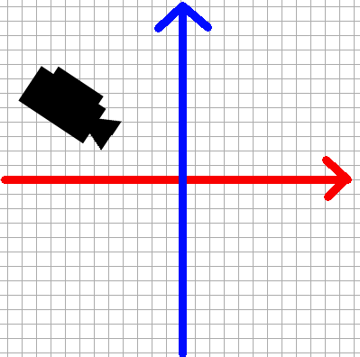
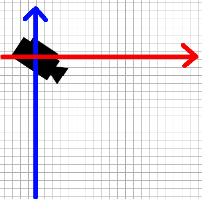
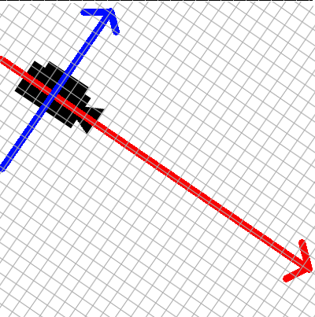

# OpenGL講習会

## 3D感をもっと出す
さて、現状はまだ3D感がないです。
先ほど覚えた行列計算を利用して、今度はカメラという概念を導入します。
カメラという概念に必要なのは、「位置」と「姿勢」です。姿勢とは、要するにカメラがどういう向きに置いてあるかです。
位置はもちろん3次元ベクトルを使えば表現できますが、姿勢というのも「どっちを向いているか」を表す3次元ベクトルで表現できるでしょうか？
答えはNOです。「どっちを向いているか」があるだけでは、カメラはその方向を軸として回転する自由度を得てしまいます。
解決策として、「カメラの上方向はどっちを向いているか」という情報を与えてやるというものがあります。
「カメラの前方向のベクトル」と「カメラの上方向のベクトル」の2つでカメラの姿勢は一意に定まります。
以上から、カメラを表すには3つのベクトルがあればいいことがわかりました。で、これからどうやってカメラをOpenGLの世界に持っていきましょう？

再三言いますが、OpenGLでできるのは三角形を描くことだけです。ということは、カメラの状態に応じて三角形の頂点座標をいい感じに変換するしかありません。つまり、各頂点座標を「カメラから見た座標」に変換するのです。
先ほどからVBOに指定している座標を置いている空間を**ワールド空間**と言い、カメラから見た座標を置く空間を**ビュー空間**と言います。
ワールド空間上の座標をビュー空間上の座標に変換する行列を考えましょう。

方針としてはこうです。
ワールド空間上にカメラがあります。

まず、カメラの位置を空間の原点とするような平行移動を施します。

次に、カメラの前方向と上方向に沿うように座標軸を回転します。

この2段階の変換を各頂点に対して施せば、頂点座標がビュー空間に移ります。

この図は2次元ですが、実際には3次元です。そのため、カメラの前方向と上方向だけでなく横方向も座標軸に沿うようにしなければならず、横方向のベクトルを求める必要があります。
ですが2つのベクトルがもうあるので、あとはこれに垂直なベクトルをとればいいだけです。これは外積を使えば出てきますね。

ではカメラの位置を$\vec e$、カメラの姿勢を表すベクトル(基底ベクトル)をそれぞれ$\vec \alpha, \vec \beta,  \vec \gamma$として行列を作ってみましょう。
まず、1つ目の変換は簡単ですね。$\vec e$が原点に来るように平行移動すればいいので、
$$$
M_1 = \left( \begin{array}{cccc}
1 & 0 & 0 & -e_x \\
0 & 1 & 0 & -e_y \\
0 & 0 & 1 & -e_z \\
0 & 0 & 0 & 1
\end{array} \right)
$$$
です。
2つ目の変換は標準基底からある正規直交基底への基底変換ですので、
$$$
M_2 = \left( \begin{array}{cccc}
\alpha_x & \alpha_y & \alpha_z & 0 \\
\beta_x & \beta_y & \beta_z & 0 \\
\gamma_x & \gamma_y & \gamma_z & 0 \\
0 & 0 & 0 & 1
\end{array} \right)
$$$
です。
これらを順に適用するような行列を作ればいいので、
$$$
M_2 \times M_1 = \left( \begin{array}{cccc}
\alpha_x & \alpha_y & \alpha_z & -\vec e \cdot \vec \alpha \\
\beta_x & \beta_y & \beta_z & -\vec e \cdot \vec \beta \\
\gamma_x & \gamma_y & \gamma_z & -\vec e \cdot \vec \gamma \\
0 & 0 & 0 & 1
\end{array} \right)
$$$
ですね。
これを用意しておけば、カメラから見た頂点座標が計算できるわけです。

```javascript
const lookAt = (eye, forward, up) => {
    const side = normalize(cross(up, forward));
    up = normalize(cross(forward, side));
    return [
        side.x, up.x, forward.x, 0,
        side.y, up.y, forward.y, 0,
        side.z, up.z, forward.z, 0,
        -dot(eye, side), -dot(eye, up), -dot(eye, forward), 1
    ];
};
...
const forward = normalize(vec3(-eye.x, -eye.y, -eye.z));
const up = vec3(0,1,0);
const viewMatrix = lookAt(eye, forward, up);

gl.uniformMatrix4fv(viewMatrixLocation, false, viewMatrix);
gl.uniform3f(colorLocation, 1,0,0);
gl.drawArrays(gl.TRIANGLES, 0, 3);
gl.uniform3f(colorLocation, 0,0,1);
gl.drawArrays(gl.TRIANGLES, 3, 3);
gl.flush();

```
```glsl
attribute vec3 position;
uniform mat4 viewMatrix;

void main() {
    gl_Position = viewMatrix * vec4(position, 1.);
}
```
eyeという変数はカメラの位置を表すベクトルです。forwardがカメラの前方向を表すベクトル、upが上方向を表すベクトルです。
この時点ではforwardとupは直交していませんが、lookAtの中で直交するように補正してあります。
normalizeやdotなどの各種ベクトル用関数は用意しておきました。
normalizeがベクトルの長さを1にする関数、dotが内積、crossが外積です。