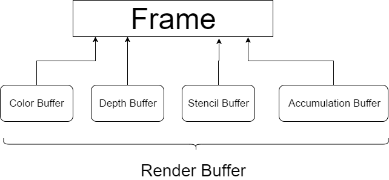

# OpenGL講習会
## オフスクリーンレンダリング

Off(離れて) Screen Renderingということで、「画面以外への描画」というのをやってみようと思います。画面以外というのは、ずばり**テクスチャ**です。

テクスチャに描画することによって、例えば「画面すべての色を反転する」といった「画面そのものへの干渉」が可能となります。

オフスクリーンレンダリングは、例えばもっと忠実な鏡の演出、影の描画、あるいはポストエフェクト(先ほどの例のような画面そのものへの干渉)といった幅広い応用が利く技術です。

今回のサンプルでは色の反転、いわゆるネガポジ反転というのを画面の半分に掛けていました。

動作原理はこんなかんじです。

1. 物体をテクスチャに対して描画する
1. 物体をスクリーンに対して描画する
1. テクスチャを反転して描画するシェーダを用いて、画面の右半分にテクスチャを乗せた長方形を描画

テクスチャにモノを書き込めるという事実を知っていれば、原理自体は大したことではないはずです。
では実際にOpenGL語ではどういう風に動いているのかを見ていってみましょう。

## Frame Buffer Object
はいまたOpenGL用語です。「また〇〇 Buffer Objectかよ...」とうんざりするかもしれませんが、頑張って食らいついてほしいです。(ちなみに筆者はもううんざりしています)
まぁとにかく前述した「テクスチャへの描画」というものの実現にはこのFrame Buffer Object、通称FBOというものを使わざるを得ないのです。

さて、今まで画面にモノを描いて来ましたが、画面のピクセル上にはどんな情報が乗っているのでしょう？
まず、色です。RGBですね。
それから、深度値というのがあったのを覚えているでしょうか？「現在そのピクセルに描かれているものがどのくらいの深さ(画面からの遠さ)にあるか」という値をピクセルに埋め込んで、それを見ることで一番手前側の物体を描画するようになっていました。
これらはOpenGL的にはColor Buffer, Depth Bufferという名前をしており、ピクセルを構成する要素として定義されています。ここでは説明しませんが、実は他にもピクセルを構成する要素があり、Stencil BufferとかAccumulation Bufferなんていう名前をしています。
ということで、一口に「画面」と言っても正確にはColor Buffer, Depth Buffer, Stencil Buffer, Accumulation Bufferをすべてひっくるめているわけです。
そして、これらをすべてひっくるめたものを、OpenGLではFrameと呼んでいます。このFrameを操るのがFBOです。
また、Color BufferやDepth Bufferなんかを総称してRender Bufferと呼んでいます。


これらはOpenGLのAPIでGPU上に作ることもできますが、デフォルトで必ず1つは存在しています。(でないと画面上に色も深度値も保存できないです。)

FBOの準備方法は次のようなかんじになります。

1. Frame Bufferを作る
1. 必要なRender Bufferがあればそれを作る
1. Render BufferをFrame Bufferと関連付ける

これはまぁこういうものです。「じゃあFrame BufferとかRender Bufferとかって何が便利なの？」と思うわけですが、なんとこれだけでは何にも使えません。
これが揃うと、「仮想的な画面上への描画」が可能にはなります。が、それだけです。GPU上ではうまく動いていますが、それが画面に反映されることはありません。
そこで、OpenGLでは**Render BufferとTextureを入れ替えてもいいよ**というルールを追加してあります。
これにより、例えばColor Bufferの部分をRender BufferではなくTextureにしておけば、そこの描画結果の色情報が手に入ります。あるいは、Depth BufferのほうをTextureに変えればそこの深度値がテクスチャとして受け取れます。
つまり、ただ画面の色状態を取得したい場合には以下のような処理をします。

1. Frame Bufferを作る
1. Color Buffer用のTextureを用意する
1. TextureをColor BufferとしてFrame Bufferと関連付ける
1. Depth Buffer用のRender Bufferを用意する
1. Render BufferをDepth BufferとしてFrame Bufferと関連付ける

私は最初これをやったとき、「欲しいのは色情報なんだからDepth Buffer用のRender Bufferって要るの？」と思ったのですが、それがないと深度テストができなくなるのでもちろん必要なんですよね。

ということで実際のコードはこんなかんじになります。

```javascript
/* Render Buffer (for Depth) */
const renderBuffer = gl.createRenderbuffer();
gl.bindRenderbuffer(gl.RENDERBUFFER, renderBuffer);
gl.renderbufferStorage(gl.RENDERBUFFER, gl.DEPTH_COMPONENT16, 512, 512); //512x512でDepth Buffer用のRender Bufferという設定にする
gl.bindRenderbuffer(gl.RENDERBUFFER, null);

/* Target Texture */
const targetTexture = gl.createTexture();
gl.bindTexture(gl.TEXTURE_2D, targetTexture);
gl.texImage2D(gl.TEXTURE_2D, 0, gl.RGBA, 512, 512, 0, gl.RGBA, gl.UNSIGNED_BYTE, null); //RGBAを格納できる512x512のテクスチャを作る。初期値はnull。
//以下3行はあんまり意味がない(コピペ)
gl.texParameteri(gl.TEXTURE_2D, gl.TEXTURE_MAG_FILTER, gl.LINEAR);
gl.texParameteri(gl.TEXTURE_2D, gl.TEXTURE_MIN_FILTER, gl.LINEAR);
gl.generateMipmap(gl.TEXTURE_2D);
gl.bindTexture(gl.TEXTURE_2D, null);

/* Frame Buffer */
const frameBuffer = gl.createFramebuffer();
gl.bindFramebuffer(gl.FRAMEBUFFER, frameBuffer);
gl.framebufferRenderbuffer(gl.FRAMEBUFFER, gl.DEPTH_ATTACHMENT, gl.RENDERBUFFER, renderBuffer); // Frame BufferにDepth用のRender Bufferを関連付け

gl.framebufferTexture2D(gl.FRAMEBUFFER, gl.COLOR_ATTACHMENT0, gl.TEXTURE_2D, targetTexture, 0); // Fraem BufferにColor用のTextureを関連付け
gl.bindFramebuffer(gl.FRAMEBUFFER, null);

...
/* テクスチャへのレンダリング */
gl.viewport(0,0,512,512);
gl.bindFramebuffer(gl.FRAMEBUFFER, frameBuffer);
renderScene(eye, forward, up);

/* 普通のレンダリング */
gl.viewport(0,0,canvas.width, canvas.height);
gl.bindFramebuffer(gl.FRAMEBUFFER, null);
renderScene(eye, forward, up);
if (planeInfo.program) {
    const texLocation = gl.getUniformLocation(planeInfo.program, "tex");
    gl.useProgram(planeInfo.program);
    gl.activeTexture(gl.TEXTURE3);
    gl.bindTexture(gl.TEXTURE_2D, targetTexture);
    gl.uniform1i(texLocation, 3);
    ext.bindVertexArrayOES(planeInfo.vao);
    gl.drawArrays(gl.TRIANGLE_STRIP, 0, 4);
}
```

作ったFrame BufferをbindするとそのFrameへの書き込みが開始します。bindを解除するとデフォルトのFrame Buffer(スクリーン)に描画されます。
`gl.viewport`という関数が登場しましたが、これは描画対象の矩形領域を指定する関数です。
描画対象のFrameの大きさに合わせて描画対象領域も変えているというわけですね。

```glsl
attribute vec3 position;
attribute vec2 uv;

varying vec2 vUV;

void main() {
    gl_Position = vec4(position, 1);
    vUV = uv;
}
```
```glsl
precision mediump float;

varying vec2 vUV;
uniform sampler2D tex;

void main() {
    vec2 uv = vUV;
    uv.x = uv.x * .5 + .5;
    gl_FragColor = texture2D(tex, uv);
    gl_FragColor.rgb = vec3(1) - gl_FragColor.rgb;
}
```
四角形は3Dとかガン無視で普通に画面の右半分に置きたかったので、カメラ用の行列などは掛けずに直に`gl_Position`に流しています。
色の反転は元の色を1から引いているだけですね。
