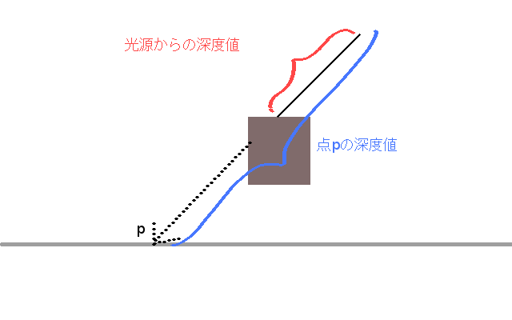
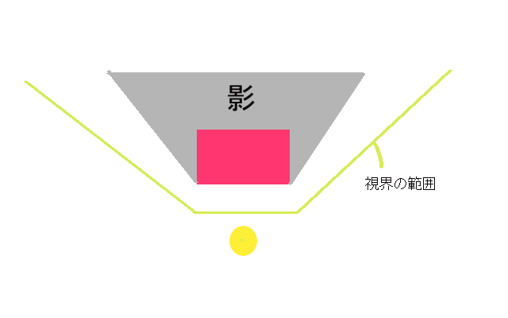
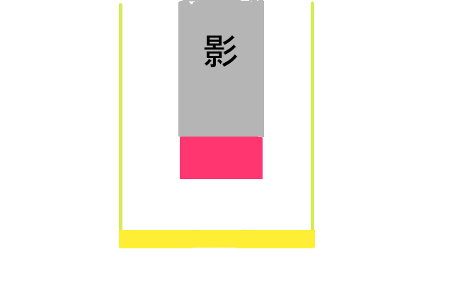

# OpenGL講習会
## $\dagger$闇$\dagger$
世界をリアルに見せる方法として強力なのは光の存在です。
レンダリング技術のほとんどがこの光をどれだけ適当にシミュレートするかにかかっています。
光を光たらしめるためにはどうしても光と対になる影の存在が重要です。
正確には「影(Shadow)」と「陰(Shade)」があり、陰を作るのは比較的簡単ですが影を作るのは至難の業です。
というのも、簡単な陰はもうすでに作っています。Phong Shadingです。
Phong Shadingで光の当たらない箇所は暗く描画されるようになっていました。あれが陰です。
一方影はいままで使った技術をフル動員しないと作ることができません。
いまから説明する方法で作られる影はとても基本的で視覚効果の薄いものですが、派生する様々な影生成技術の根幹を担う考え方ですので、ぜひ覚えてみましょう。

## 影の生成
オフスクリーンレンダリングのとき、Render Buffer(Color BufferやDepth Buffer)には代わりにテクスチャを利用できると書きました。それを利用しColor Bufferにテクスチャをアタッチすることでネガポジ反転を実装したわけですが、影を作るにはDepth Bufferを使います。
単純な話、「影ができる場所」というのは「光源から見えない場所」ということになります。
すると「光源の位置にカメラを置いて、そこから見えるかどうかで影の有無を決定する」というのは自然な発想でしょう。

この工程を分割してみます。
1. 光源の位置にカメラを置く
1. 光源カメラで物体をオフスクリーンレンダリングする
1. オフスクリーンレンダリングされた画像を参考にして影の有無を判定

1と2は普通にできそうな気がします。
「カメラを置く」というのは「カメラの位置と向きを定義する」に相当するので定義すればいいだけですし、そこからのオフスクリーンレンダリングも前回やった通りにすればできます。
となると3が一番曖昧かつ厄介なテーマです。

光源からの景色をオフスクリーンレンダリングしたテクスチャを**Shadow Buffer**と呼ぶことにしますが、これには深度値の情報がDepth Bufferとして入っています。
深度値とは何だったかもう一度説明しておくと、形式的には「射影変換後のZ座標の最小値」で直感的には「そのピクセルにおいて描画されている物体とカメラとの距離(みたいなもの)」です。
つまりShadow Bufferを見ると、その位置に見える物体がカメラとどれくらいの距離にあるかがわかります。
これがどうも使えそうです。

ある点$\vec p$に影がかかるかは以下のように調べられます。
1. $\vec p$を光源視点での射影空間上の点$\vec p_{sp}$に変換する
1. $\vec p_{sp}$の深度値を算出
1. $\vec p_{sp}$の$x,y$をShadow BufferのUVと対応させて光源から見たその地点での深度値を取得
1. 2つの深度値を比較し、$\vec p_{sp}$の深度値のほうが大きかったら影があることにする

2で得られた深度値がその地点の光源からの深度値で、3で得られた深度値がその地点と光源を結ぶ線分の中で一番光源に近いものの深度値です。


### 平行光源とOrthographic Camera
光源の位置にカメラを置くと書きました。
カメラから見える景色によって影ができるなら、光源に置いたカメラの視界の形によって光の進み方が定義されるはずです。
例えば、前回まで扱ってきた射影変換行列を使うと、視界の範囲は四角錘台になります。
この形は奥が広がっているため、影の形も奥が広がったようになります。つまり点光源のように作用するわけですね。


これはこれで需要があると思うのですが、今回に関しては
- 調整が面倒
- 太陽光線のようにしたいので、角度がつくのはおかしい

という観点から、平行光源を採用しています(前回までもPhong Shadingで利用していたのは平行光源でした)。

よって、図はこんなかんじになります。


「光源」というのはもはやなく、漠然と方向だけがあるかんじです。
これを使わないとまっすぐに影が伸びません。

ですがこれを実現するためには前回まで使っていた射影変換の行列を使えません。
結論から言うと、カメラのパラメータは幅$w$, 高さ$h$, near clipを$n$, far clipを$f$として

$\left( \begin{array}{cccc} 
\frac 2 w & 0 & 0 & 0 \\\\
0 & \frac 2 h & 0 & 0 \\\\
0 & 0 & \frac 2 {n-f} & \frac {n+f} {n-f} \\\\
0 & 0 & 0 & 1 \\\\
\end{array} \right)$

で定義される行列が平行光源版の射影変換行列です。
これはただ単純にパラメータで与えられた直方体領域を、各頂点の座標が1か-1となるような領域に正規化するだけのもので、以前やった遠近法のようなことはしません。

これで平行光源が定義できます。

### 影の実装
以上で道具はすべてそろったので、導入するだけです。
注意として、テクスチャへの読み書きは同時には行えないので影用のテクスチャを2枚用意しておき毎フレーム入れ替えるという処理が必要となります。

重要な箇所は影を描画するフラグメントシェーダ部分のみなので、そこだけ抽出して書きます。
```glsl
...
//光源から見た座標
vec4 pos4FromLight = shadowProjMatrix * shadowViewMatrix * vPosition;
//4次元から3次元に変換
vec3 posFromLight = pos4FromLight.xyz / pos4FromLight.w;
//Shadow BufferのUV座標を算出
vec2 shadowUV = posFromLight.xy * 0.5 + 0.5;
//UVの範囲を見てあげる(そうしないと、範囲外の部分はループしてしまい辺な影が出る可能性がある)
if (0. <= shadowUV.x && shadowUV.x <= 1.
  && 0. <= shadowUV.y && shadowUV.y <= 1.) {
  // Shadow Buffer上の深度値
  float shadowMapZ = texture2D(shadowMap, shadowUV).r;
  // 実際の深度値
  float zFromLight = posFromLight.z * 0.5 + 0.5;

  if (zFromLight > shadowMapZ + 0.01) {
    gl_FragColor.rgb *= 0.5;
  }
}
```

### ダメ出し
一応このデモではうまく動くように見えると思いますが、この技術に関しては弱点が結構いろいろあります。

- Shadow Cameraで映した範囲の情報しか使えないため、あまり大きな範囲に影を落とせない
  - 無理に範囲を大きくすると解像度が落ちて影がガタガタになったり、意味不明なジャギーが出たりする  
- 点光源にするとこのままでは使えない(カメラで全方位は映せない)
- 影がくっきりしているが、現実の影がもっとぼやける
  - Soft Shadowで検索するといくつか手法は出てくる
-  単純に全ての物体を2回描画することになうため、重い。

影の技術はほんとうに$\dagger$ 闇 $\dagger$なので、はやく「これしかない！」という手法が確立されるのを期待しています。
