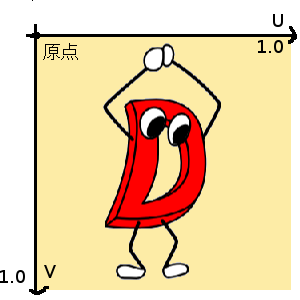

# OpenGL講習会

## テクスチャ

次はテクスチャというものを扱ってみようかと思います
テクスチャとはなんぞや？と言えば、まぁ画像のことです。
ただ案の定というか、OpenGLでは2Dの普通の描画APIに比べて数段面倒くさいです。

一般的な2Dの描画ではきっと、`drawImage(img, x, y)`といったかんじで`img`を画面に表示することができると思います。ですがOpenGL(に限らず多くの3Dライブラリ)では画像の扱いがそもそも異なります。

まず前提として、OpenGLでは画像データを直接画面に表示する手段は提供されていません。
どうするかというと、ポリゴンに画像を貼り、そのポリゴンを描画することで画面に画像を表示します。
ポリゴンに画像を貼るというのは、頂点座標に画像上の座標を対応させることで実現します。

前回の法線と同じように、頂点ごとにその頂点のところに画像上の位置を指定しておき、`varying`に突っ込むと自動的に補間してくれます。
これを使ってテクスチャを貼っていきます。

ちなみに、3D空間の座標はXYZで表しますが、画像上の座標はそれと区別するため、左右方向はU,上下方向はVで表します。そのため、頂点と対応させる画像上の座標のことを**UV座標**と呼びます。
OpenGLではUV座標の単位はピクセルではなく、画像をすっぽり覆う矩形領域が(0,0)から(1,1)になるようになっています。



例えば、四角形のポリゴンにテクスチャを素直に貼りたければ4頂点に(0,0),(1,0),(0,1),(1,1)を対応させれば良いというわけです。

テクスチャもJavaScript側でImageとして読み込んだものをテクスチャとしてGLSLへ転送します。
これはUniformで行われますが、今までの数値データと違い、画像データを直接送信するのではなく**テクスチャユニット**と呼ばれるものを通します。
これはテクスチャのデータ量がベクトルなんかと比べて多すぎるため、最初に1回だけ送信してあとはその番号で扱おうという配慮です。C言語でいう超大きな構造体に対するポインタがテクスチャユニットだと思ってください。

というわけで、テクスチャの送信は
1. テクスチャ用のバッファを用意
2. JavaScriptのImageをバッファに与える
3. バッファとテクスチャユニットを結び付ける
4. テクスチャユニットをUniformで送信

という順番に行われます。

また、テクスチャを活用する際には**ミップマップ**というものも生成しなければなりません。
OpenGLではポリゴンに貼るという性質上、テクスチャの拡大縮小が頻繁に行われます。
なので、予め拡大縮小をある程度行っておいたものを用意します。それがミップマップです。
ですが、これを明示的にいじるようなことはあまりないので、とりあえず`generateMipMap`という関数を呼んでおけば大丈夫です。

```javascript
const vertices = []; //頂点
const normals = []; //各頂点の位置での法線
const uvs = []; //UV座標
...
// vertices, normals, uvsに代入
...
// attributeにuvを追加
...
const img = new Image();
img.src = "./dman.png";
// 画像読み込み後の処理
img.onload = _ => {
    // テクスチャユニット0番を有効化
    gl.activeTexture(gl.TEXTURE0);
    // テクスチャの素を作る
    const tex = gl.createTexture();
    // テクスチャユニット0番とtexを結び付け、かつバインド
    gl.bindTexture(gl.TEXTURE_2D, tex);
    // JavaScript側の画像データをOpenGL側のテクスチャに結び付ける
    gl.texImage2D(gl.TEXTURE_2D, 0, gl.RGBA, gl.RGBA, gl.UNSIGNED_BYTE, img);
    // ミップマップを生成
    gl.generateMipmap(gl.TEXTURE_2D);
};
```
```glsl
...
attribute vec2 uv;
varying vec2 vUV;
...
vUV = uv;
...
```

```glsl
...
varying vec2 vUV;
uniform sampler2D tex;
...
vec4 color = texture2D(tex, vUV);
...
```

テクスチャは`sampler2D`という型になります。
テクスチャの特定の座標のRGBAはGLSLの組み込み関数の`texture2D`で取得できます。