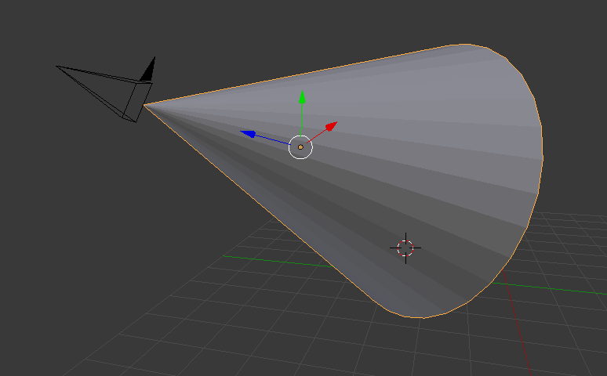
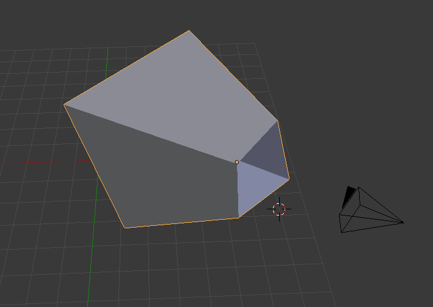
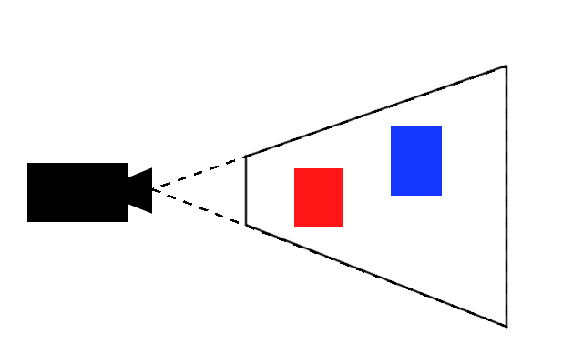
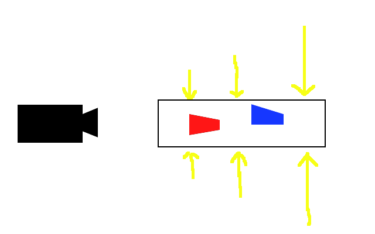
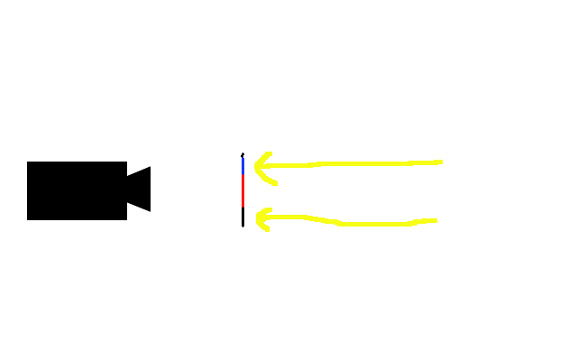
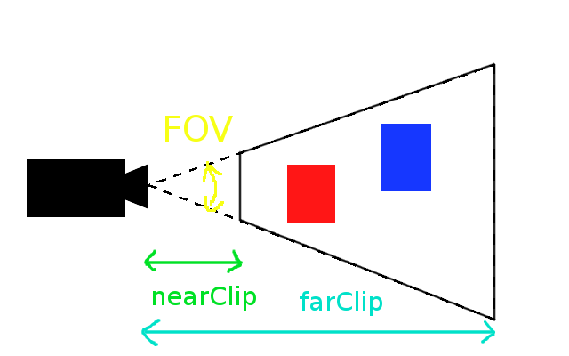

# OpenGL講習会

## 3D感をもっともっと出す
次の3D感はズバリ、遠近法です。
ご存知の通り我々の世界では遠くのものほど小さく、近くのものほど大きく見えます。
ですが残念ながらいまの状態ではまったくそんなことにはなっていません。
これをOpenGLが勝手にやってくれたりはしないからです。
自分でやるしかないのです。

## 射影変換
遠近感を出すために遠くのものほど小さくなるような変換、これのことを**射影変換**と言います。
今からこの射影変換を行う行列を作っていきます。

### カメラのモデル化
カメラの映す範囲をまず考えてみましょう。
イメージ的にはこんな範囲で物を映す気がします。

円錐形ですね。本当はこれが映す範囲ということにしたいのですが、残念ながらこれを採用してしまうと計算が面倒なことになってしまうのです。なので$\dagger$ちょっと$\dagger$似てるかんじでこんな形ってことにします。

わかりますかね？四角錘の上削ったバージョンです。
この範囲に収まるものを描画することにしましょう。

### OpenGLの描画領域
OpenGLの描画領域は(1,1)から(-1,-1)の範囲であると2Dの時説明しました。この範囲外にある部分は描画されません。
これが3Dになると、Zの値にも制限がつきます。3Dの場合には(1,1,1)から(-1,-1,-1)の範囲にある立方体領域にある部分しか画面に描画されません。

ということは、先の四角錘の内部の空間を(-1,-1,-1) ~ (1,1,1)の立方体領域に圧縮できればカメラから遠いものは勝手に小さくなるし描画領域も整うしで一石二鳥ってかんじがします。

### 描画の流れ
てことで、3D空間上のものがどうやって画面上に現れるかを順に見ていってみましょう。



このようになっているとします。黒いのがカメラで、赤と青が描画される物体です。
まず、これを押しつぶして直方体にします。



このとき、空間内部の物体も同様に押しつぶされます。これにより、遠くのものほど小さくなります。
次に直方体を前後方向に押しつぶして2次元にしてしまいます。



このとき、深度テストにより2物体以上が被っている場合は近いものを優先します。
こんなかんじの流れになります。では行列を計算してみましょう。

### カメラのパラメータ
カメラの描画領域を四角錘っぽい形にしましたが、あの形状を表すために4つのパラメータを導入します。

- カメラのy方向の視野角 
Field Of View の略でFOVと呼ばれています。
- アスペクト比 
底面の幅 / 底面の高さ
- 近い側の底面を表すz座標 
near clip と呼ばれます。
- 遠い側の底面を表すz座標 
far clip と呼ばれます。



これだけあれば描画領域の形を定義できそうです。

### 行列計算
では行列を作っていきます。とりあえず前提として、すべての座標がビュー空間にある、つまりカメラの場所にちょうど原点があり、座標軸とカメラの向きは揃っているということにしてください。
注意されたいのは、この座標系が**右手系か左手系か**ということです。x,y,z軸が親指、人差し指、中指に対応するとき、かならず右手か左手かのどちらかにしか合いません。直感的に考えるとx,y,z軸はそれぞれ右、上、奥が正方向となる気がしますが、これは左手系です。一方、OpenGLや数学で扱う座標系は右手系です。この違いを解消するために、z軸が手前を向いているというちょっと気持ち悪い設定にしなければなりません。
するとy座標はz座標が小さいほど縮小されます。
z = -$nearClip$のとき、yは$[-nearClip \times \tan(\frac {FOV} 2), nearClip \times \tan(\frac{FOV} 2)]$の範囲を[-1,1]に縮小し、
z = -$farClip$のとき、yは$[-farClip \times \tan(\frac {FOV} 2), farClip \times \tan(\frac{FOV} 2)]$の範囲を[-1,1]に縮小すればいいということです。
$y \mapsto \frac y {-z \times \tan(\frac {FOV} 2)}$
同様に、x座標も
$x \mapsto \frac x {-z \times aspect \times \tan(\frac {FOV} 2)}$
とすればいいのがわかります。

ここでおや？と思ってくださるでしょうか？xとyの変換には**分母**にzが入っています。これの意味するところは、**x,yの変換は線形変換ではない**ということです。つまり、行列にできません。

ですが思い出してください。我々は4次元ベクトルと3次元ベクトルを行き来するためのあるルールを作っていました。
$(x,y,z,w) \mapsto (\frac x w, \frac y w, \frac z w)$
今まで頂点シェーダのgl_Positionには4次元ベクトルを入れていました。この4次元ベクトルは上記の変換を**自動で**行い、3次元ベクトルとして内部で処理されます。これを利用すると、予めwに-zを入れておけば割り算できるということになりますよね？
つまり、こうです
$(x,y,z,1) \mapsto (\frac x {aspect \times \tan(\frac {FOV} 2)}, \frac y {\tan(\frac {FOV} 2)}, ?, -z)$
あとの?の部分に何が入るか考えましょう。?の値は以下の条件が掛かります。
- $z = -nearClip$のとき$\frac ? {-z} = -1$
- $z = -farClip$のとき$\frac ? {-z} = 1$
- ?はzの一次式($\Rightarrow az + b = ?$)

以上の条件から連立方程式
$$$
a \times -nearClip + b = -1 \times nearClip \\
a \times -farClip + b = 1 \times farClip
$$$
を解くと、
$$$
? = \frac {-(farClip + nearClip)z - 2 farClip \times nearClip}{farClip - nearClip}
$$$
ということで後はこれを行う行列を作ればいいわけですね。

$$$
\left( \begin{array}{cccc} 
\frac 1 {aspect \times \tan(\frac {FOV} 2)} & 0 & 0 & 0 \\
0 & \frac 1 {tan(\frac {FOV} 2)} & 0 & 0 \\
0 & 0 & \frac {nearClip + farClip} {nearClip - farClip} & \frac{2farClip \times nearClip} {nearClip - farClip} \\
0 & 0 & -1 & 0
\end{array} \right)
$$$
これが射影変換行列です。できたー！

```javascript
const perspective = (asp, fov, near, far) => {
    const t = Math.tan(fov / 2);
    return [
        1 / (asp * t),0,0,0,
        0,1/t,0,0,
        0,0,(near+far) / (near-far), -1,
        0,0,2*near*far/(near-far),0
    ];
};
...
const projMatrixLocation = gl.getUniformLocation(program, "projMatrix");
...
const forward = normalize(vec3(eye.x, eye.y, eye.z));
...
const projMatrix = perspective(1, Math.PI / 2, 0.1, 5);
...
gl.uniformMatrix4fv(projMatrixLocation, false, projMatrix);
```

```glsl
attribute vec3 position;
uniform mat4 viewMatrix;
uniform mat4 projMatrix;

void main() {
    gl_Position = projMatrix * viewMatrix * vec4(position, 1.);
}
```