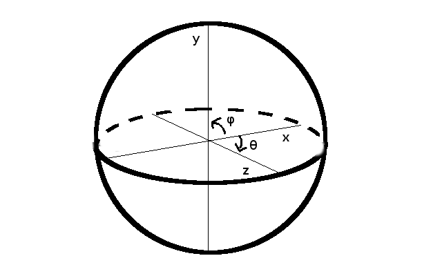
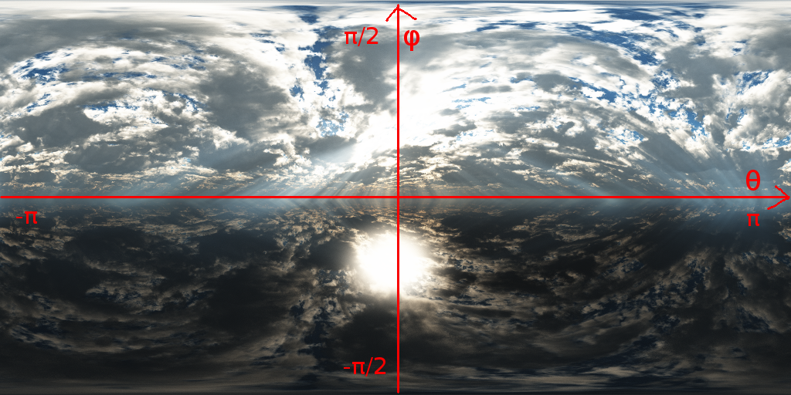

# OpenGL講習会

## 環境マップ\~反射\~

環境マップというのをやってみたいと思います。
これから〇〇マップという用語が出てきますが、それらはすべてテクスチャを用いた表現技法のことです。
今回はこんな

画像を使って、反射(っぽいもの)を表現してみようと思います。
金属などを表現したいときには効果的な演出になります。
が、もちろんこれも描画速度と受ける印象のコスパの良さを考えたなんちゃって技法です。

まず、背景ですが、球を作って↑の絵を貼っただけです。
中央の立方体は、元の色と反射して映る景色の色を一定の割合で混ぜています(この例では8:2)。
問題なのはこの「反射して映る景色の色」というのがどうやったら取得できるかなんですよね。

これを真面目にやるのはすごい面倒なので、大胆な近似を2つします。
- 反射した景色の中にあるのは空だけである
- 空は無限遠にある

1つ目は今回の場合には真ですが、実際に何か作るときに近くにモノがあればこの前提は崩れます。
まぁいいんです。どうせ**それっぽくは見える**んで。
2つ目も超嘘です。そもそもカメラを構成する式にFar Clipなるものがあるので無限遠にあるものを映すことはもはや不可能です。
まぁこれもどうでもいいです。どうせ**そんなのよくわからない**んで。
今回はカメラの視野角(FOV)を狭くすることでさらにごまかしています。

これらの仮定により相当計算は楽になります。
ではちょっと詳しく考えていってみましょう。

カメラ$\vec e$から見たある位置$\vec p$にある法線$\vec n$を持つ微小平面で反射して見える景色の色というのは、$\vec p - \vec e$を反射させた方向を$\vec p$からみた景色の色と考えられます。
(ちなみに、GLSLではベクトル`v`を法線`n`を持つ平面で反射させたベクトルは`reflect(v, n)`で出てきます。)
また、空が無限遠にあることを考えると、どこから見たかはもはやどうでもよく、見た方向のみが色に影響してくるでしょう。つまり、反射色というのは`reflect(p - e, n)`のみに依存します。
$\vec p + reflect(\vec p - \vec e, \vec n) \times \infty \approx reflect(\vec p - \vec e, \vec n) \times \infty$

次に、このテクスチャについて考えてみます。
そもそもこのテクスチャはこんなかんじで実際の3次元ベクトルと対応しています。
 

$
\begin {cases} 
x = \cos \theta \cos \phi \\
y = \sin \phi \\
z = \sin \theta \cos \phi
\end{cases}
$
$
\begin {cases} 
\theta = \arg(z, x) \\
\phi = \arg (y, \sqrt{x^2 + z^2})
\end{cases}
$

テクスチャの色は$\theta$と$\phi$がわかれば取れる。$\theta$と$\phi$は$x,y,z$がわかればとれる、ということになります。
この$(x,y,z)$こそが`reflect(p - e, n)`です。

以上のことから、こんなかんじのことを描けば反射色が取得できることがわかります。
```glsl
vec3 cameraRef = normalize(reflect(cameraEye - vPosition, normalize(vNormal)));
float t = atan(cameraRef.z, cameraRef.x);
float p = atan(cameraRef.y, length(cameraRef.xz));
vec3 refColor = texture2D(spheremap, vec2(t / PI / 2. + 0.5, -p / PI + 0.5)).rgb;
```