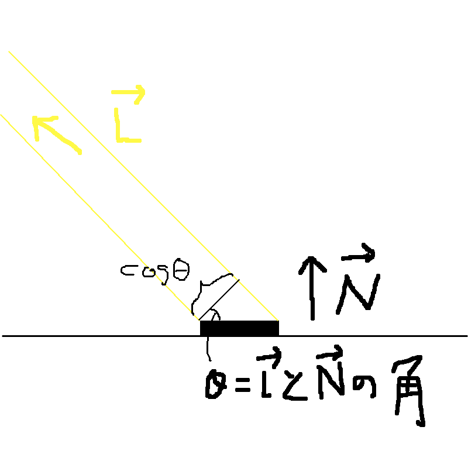

# OpenGL講習会

## $\dagger$光$\dagger$
光です。光をやります。
光のシミュレーションです。はい。
光の表現技法もまた色々とあるのですが、今回はポピュラーな**Phong Shading**というのをやってみます。

とりあえず光のシミュレーションをするには必要な材料があります。
- 光の方向
今回は太陽のように限りなく遠いところに光源がある設定でやるので、太陽の方向が必要です。
- 物体の法線
物体の表面に法線がどちらを向いているかの情報を付加する必要があります。

光の方向はとりあえず定義しとけばいいので大丈夫なのですが、法線は頑張って用意しないといけません。

それから前回までは三角形のポリゴンでしたが、それだと光が全然面白くないので頑張ってTorusを用意してみました。

さて、Phongシェーディングでは物体からカメラへ来る光を3つの種類にモデル化します。

1. 拡散光(Diffuse)
光源から出て物体表面で拡散する光です。反射ではなく拡散する光なので、光源とカメラの相対位置には関係なく純粋に当たる光の量に比例して強くなります。
1. 反射光(Specular)
光源から出て物体表面で反射する光です。
1. 環境光(Ambient)
乱反射によって不定の位置から物体を経由してカメラに入ってくる光です。適当に考えると、だいたい定数です。

それぞれの光の強さを考えてみます。

### 拡散光(Diffuse)
ある微小平面に当たる光の量は光の方向$\vec L$と法線$\vec N$の成す角$\theta$の$\cos \theta$に比例します。

よって、$\vec L \cdot \vec N$に比例すると言えます。

### 反射光(specular)
物体表面からカメラへ向かうベクトルを$\vec E$とします。
反射光は反射してきた光の方向がカメラの方向へ向かうベクトルと近いとき大きくなります。ここの近似はものすごい投げやりですが、それっぽく見えるのセーフ。
GLSLにはあるベクトル$\vec v$を法線$\vec n$を持つ平面で反射させたときのベクトルを得る関数reflectがありますので、それを使うことにします。すると、specularの大きさはだいたい
$reflect(\vec L, \vec N) \cdot \vec E$
となります。さらに、反射の鋭さをコントロールするパラメータ$\alpha$を導入し、
$(reflect(\vec L, \vec N) \cdot \vec N) ^ \alpha$
とします。内積はベクトル同士が近いときほど大きくなり、$\alpha$を大きくするとある程度まで内積が大きくないと全体としては大した大きさにならなくなります。

### 環境光(Ambient)
これは適当なので定数でいいです。

これら3つの光をすべて合計したものを1つの「光」として扱うと、なんか見た目それっぽいじゃないか！というのがPhongシェーディングという描画方法です。
「とりあえずこれやっとけばそれっぽく見える」という鉄板ネタです。
他にも似たようなものにGouraud shadingとかLambert shadingとかいったものもあるのですが、片方はPhongの劣化版で、もう片方はPhongの特殊ケースなのでPhongだけ抑えておけば多分ちょっと調べればわかると思います。

ということで、以上の数式をシェーダに持ち込めばできあがりです。
JavaScript側からGLSLに渡さなければいけないものはいくつかあるのですが、一番ここで厄介なのは「法線」です。
上の話でしれっと出てきましたが、法線とは物体の表面に対して定義されるベクトルで、表面と垂直な向きをしているものです。
Phong Shadingに必要な情報として他にはカメラの位置や光源の位置などがありますが、これらはGLSLの「いまどこの色を決めようとしているか」ということに関して定数です。
ですが、法線というのは「いまどこの色を決めようとしているか」が変わると変わってしまいます。

こういうときには`attribute`と`varying`という2つの修飾子を使います。
`attribute`は前回までも頂点を渡すために使っていました。
`attribute`には別の使い方もあり、頂点に座標以外の他の情報(ここでは法線ベクトル)を持たせるということができます。
つまり、各頂点ごとに異なる法線ベクトルを与えることができます。

確かにこれで頂点の位置にある法線がどこを向いているかはわかりますが、頂点と頂点の間の空間も無数にあるわけで、そこの法線はまだわかりません。
そこで、`varying`というのを使います。`varying`のついた変数に頂点シェーダで代入すると、フラグメントシェーダでそれを使うときに、その値をいいかんじに補間した値が代入されてきます。

まとめると、
1. JavaScriptから`attribute`に法線を渡す
2. 頂点シェーダで`attribute`の中身を`varying`に渡す
3. フラグメントシェーダで`varying`変数を使う

という手順を踏めばいいかんじにポリゴン表面の法線をフラグメントシェーダで使うことができます。

GLSL特有の3つの修飾子についてまとめておきます。

| 修飾子名 | 転送元 | 転送先 | 概要
|--------|--------|-------|----|
| attribute | JavaScript | 頂点シェーダ | 頂点座標か、その他頂点ごとに異なるデータを送る|
| varying | 頂点シェーダ | フラグメントシェーダ | 「頂点ごとに違うデータ」を補間し、「ピクセルごとに違うデータ」に変える|
| uniform | JavaScript | 頂点シェーダorフラグメントシェーダ| 場所ごとに変わらないデータを送る |

以上のことから、ソースコードはこんなかんじになります

```javascript
const vertices = []; //頂点
const normals = []; //各頂点の位置での法線
...
// verticesとnormalsに中身を入れる
...
const vertexPositionBuffer = gl.createBuffer();
const vertexNormalBuffer = gl.createBuffer();
gl.bindBuffer(gl.ARRAY_BUFFER, vertexPositionBuffer);
gl.bufferData(gl.ARRAY_BUFFER, new Float32Array(vertices), gl.STATIC_DRAW);
gl.bindBuffer(gl.ARRAY_BUFFER, vertexNormalBuffer);
gl.bufferData(gl.ARRAY_BUFFER, new Float32Array(normals), gl.STATIC_DRAW);
...
const positionLocation = gl.getAttribLocation(program, "position");
const normalLocation = gl.getAttribLocation(program, "normal");

gl.enableVertexAttribArray(positionLocation);
gl.bindBuffer(gl.ARRAY_BUFFER, vertexPositionBuffer);
gl.vertexAttribPointer(positionLocation, 3, gl.FLOAT, false, 0, 0);

gl.enableVertexAttribArray(normalLocation);
gl.bindBuffer(gl.ARRAY_BUFFER, vertexNormalBuffer);
gl.vertexAttribPointer(normalLocation, 3, gl.FLOAT, false, 0, 0);
...
```


```glsl
attribute vec3 position;
attribute vec3 normal;
uniform mat4 viewMatrix;
uniform mat4 projMatrix;
varying vec3 vPosition;
varying vec3 vNormal;

void main() {
    gl_Position = projMatrix * viewMatrix * vec4(position, 1.);
    vPosition = position;
    vNormal = normal;
}
```

```glsl
precision mediump float;

uniform vec3 color;
uniform vec3 cameraEye;
varying vec3 vPosition;
varying vec3 vNormal;

void main() {
    const vec3 lightDir = normalize(vec3(1,1,1));
    vec3 toCamera = normalize(vPosition - cameraEye);
    vec3 lightRef = reflect(lightDir, normalize(vNormal));
    float amb = 0.1;
    float dif = max(0., dot(normalize(vNormal), lightDir));
    float spc = pow(max(0., dot(toCamera, lightRef)), 10.);
    gl_FragColor = vec4((amb + dif) * color + spc * 0.5, 1);
}
```
