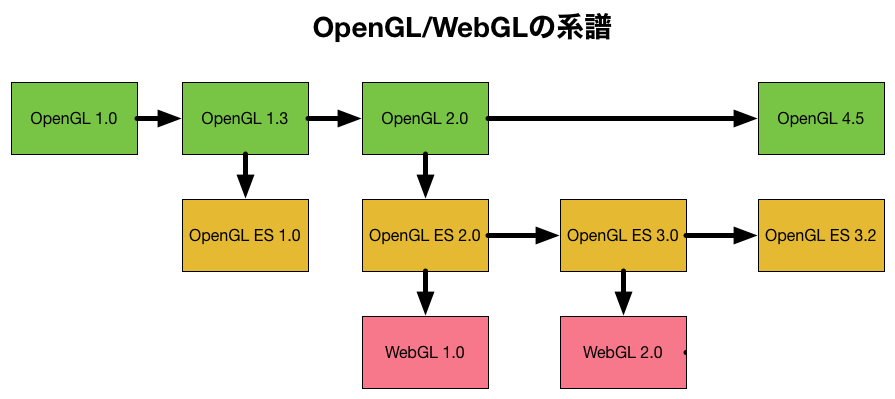
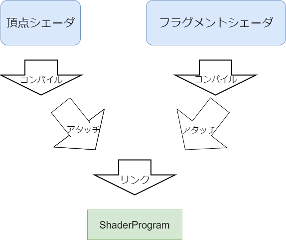

# OpenGL講習会
ようこそ！OpenGL講習会へ！
今回はJavaScriptを使ってOpenGLというライブラリについて学んでいくことにします。

## OpenGLって？
OpenGLとはOpen Graphics Libraryを意味し、その名の通り3Dのグラフィックスを扱うためのライブラリです。OpenGLはマルチプラットフォーム、つまり様々なOSや言語で似たような使い方のできるライブラリですので、今回JavaScriptで使う方法は他の言語でも生かすことができます。
昨今たくさんの3Dライブラリが世に溢れていますが、そのほとんどはDirectXというライブラリかこのOpenGLを使ってできています。つまり、OpenGLの正しい使い方を覚えれば3Dのライブラリを自作することもできるようになります。

## いろいろなOpenGL
OpenGL自体は歴史の古いライブラリで、バージョンの違いでいくつか種類があります。

- OpenGL
OpenGLシリーズの中でオリジナルのバージョン。最新の機能は主にこれに搭載される。
- OpenGL ES
OpenGL for Embedded System。スマホやゲーム機などの端末に搭載するためのOpenGLのサブセット。
- WebGL
ブラウザで使われるOpenGL。OpenGL ESからの派生なため、こちらもOpenGLのサブセットになる。


今回はJavaScriptでOpenGLを扱うため、正確にはWebGLを使います。
PCゲームを使うときにはオリジナルのOpenGL、スマホのアプリで3Dを扱う場合にはOpenGL ES、WEBで見られるものを作るにはWebGLを使うのが一般的です。

## OpenGLの使い方概要
ではさっそく具体的なOpenGLの使い方について説明します。
Canvasなどの2Dグラフィックスを扱ったことのある人は、もしかしたらこういうコードを見たことがあるかもしれません。
```c
drawRect(x,y,w,h,color);
```
疑似コードなので具体的にどのライブラリというわけではないのですが、(x,y)の位置に(w,h)の大きさをもった矩形をcolorの色で描く、といった命令です。
OpenGLでこの命令を実現しようと思うと、途方もない面倒臭さがあります。

理由はいくつかあって、まず1つとしてあるのが**OpenGLは三角形しか描けない**という点です。OpenGLで何か図形を描きたいと思ったら、まずその図形を三角形に分割し、その頂点座標を指定しなければ描画ができないのです。

2つ目の面倒臭さは、**シェーダ**と呼ばれる概念です。OpenGLではより汎用的な描画を実現するために、図形の変形(平行移動、回転、拡大など)や自由な著色を実現するための特殊なプログラムを書く機能がついていて、これをシェーダといいます。
OpenGLの古いバージョンでは描画の汎用性が乏しい代わりに、シェーダを描かなくてもある程度の変形や著色ができるように関数が提供されていたのですが、バージョンが上がるとそれらの機能が廃止され、必ずシェーダを書かなければならない仕様に変わってしまいました。

したがって、上のdrawRectのような命令をOpenGLで行おうとすれば、以下のようにする必要があります。
1. 指定されたx,y,w,hから四角形の頂点の座標を計算する
1. 四角形は描画できないので、三角形に分割する
1. 変形を定義するシェーダを書く(この場合には変形は要らないが、それでも書かないといけない)
1. 指定されたcolorで塗りつぶすという著色方法を定義するシェーダを書く
1. 以上の設定を反映し、描画を実行する

...面倒ですね。これらの冗長な設定のうち、ある程度をデフォルトで定義してくれるのがいわゆる3Dライブラリというわけです。
まぁ今回はOpenGLの学習なので、これをとりあえずやってみましょう。

## 白い三角形を描いてみる
さぁ果てしない旅の始まりです。長い旅ではありますが、個々の山はそれほど高くないので順番にこなしていきましょう。

### GLコンテキストを取得する
今回はブラウザで動くWebGLを使っていきますので、その関数群を持ってこなければなりません。それがGLコンテキストです。
```javascript
const gl = canvas.getContext("webgl");
```
WebGLの描画内容はCanvas内に出てくるので、canvasを先に用意しておく必要があります。(が、それはOpenGLとは関係ないのではしょります。)

### 頂点を用意する
頂点データを扱うには**VBO**(Vertex Buffer Object)というものを使います。
VBOを作成し、そこに頂点座標の配列を渡します。
```javascript
const vertexBuffer = gl.createBuffer();

//送り先のVBOを指定
gl.bindBuffer(gl.GL_ARRAY_BUFFER, vertexBuffer);

//頂点データをVBOに送る
gl.bufferData(gl.GL_ARRAY_BUFFER, new Float32Array([
	0.0, 0.5,
	0.5, 0.0,
	-0.5, 0.0
]));
```
bindBufferでデータの送り先のVBOを指定し、bufferDataで実際に配列のデータを流し込みます。
これらの関数は、頂点データを流し込む以外の使用用途もあるため、GL_ARRAY_BUFFERを指定することで、今回の使用用途は頂点データですよ、というのを伝えます。
ちなみに、OpenGLの座標系はピクセル単位ではありません。描画領域の右上が(1,1),左下が(-1,-1)であるような座標上で座標を指定します。

### シェーダを記述する
シェーダとは、頂点の変換や著色方法を指定するものでした。
OpenGLでは頂点の変換を記述するシェーダを**頂点シェーダ(Vertex Shader)**、著色を記述するシェーダを**フラグメントシェーダ(Fragment Shader)**と言います。
これらの記述には、**GLSL**(OpenGL Shader Language)という特殊な言語を用います。GLSLはC言語風の構文にいくつかの標準変数や関数がくっついたものです。
このGLSLはC言語なんかと同じように、コンパイルやリンクを必要とするものです。
2つのシェーダをコンパイルし、リンクしたものを**Shader Program**と呼びます。


### GLSLで頂点シェーダを記述する
今回は与えられた頂点を何も変形させないシェーダを書いてみます。
```glsl
attribute vec2 position;
void main() {
  gl_Position = vec4(position.x, position.y, 0, 1);
}
```
頂点シェーダは描画しようとすると**与えられた頂点それぞれに対して**実行されます。
その際、attributeと書かれた変数に与えられた頂点データが入り、変換後の頂点座標はgl_Positionという変数に入れることになっています。
vec2やvec4というのはGLSLが標準で提供するベクトルの型です。今回は二次元の三角形を描くので、入力データであるattribute変数の型はvec2ですが、変換後の座標であるgl_Positionの型はvec4と決まっています。vec4のx,y,z,w要素のうち、最後のw要素には1を入れることになっています。zの値は今回あまり意味がないのでとりあえず0にしておきます。

### GLSLでフラグメントシェーダを記述する
今回は白で塗りつぶすシェーダを書いてみます。
```glsl
void main() {
  gl_FragColor = vec4(1,1,1,1);
}
```
フラグメントシェーダは描画しようとすると、**その三角形の領域内のすべてのピクセルに対し**実行されます。
その際、そのピクセルの色はRGBAを要素とするvec4の変数gl_FragColorに入れることになっています。

### シェーダをコンパイルする
シェーダファイルの拡張子がextension、シェーダのソースコードがcodeという変数に文字列として入っていることにします。
```javascript
let shaderType;
switch (extension) {
case "vert":
	shaderType = gl.VERTEX_SHADER;
    break;
case "frag":
	shaderType = gl.FRAGMENT_SHADER;
    break;
}
const shader = gl.createShader();

//シェーダとそのソースコードを結び付ける
gl.shaderSource(shader, code)

gl.compileShader(shader);

//コンパイルが失敗していたらエラー表示
if (!gl.getShaderParameter(shader, gl.COMPILE_STATUS)) {
	console.log(gl.getShaderInfoLog(shader))
}
```

### 2つのシェーダをリンクする
さきほどcreateShaderで作られたものが、頂点シェーダはvs,フラグメントシェーダはfsという変数に入っているということにします。
```javascript
const program = gl.createProgram();

//ShaderProgramと2つのシェーダを結びつける
gl.attachShader(program, vs);
gl.attachShader(program, fs);

gl.linkProgram(program);
```

### 頂点シェーダのattributeとVBOを結びつける
最後に、先ほど頂点シェーダで宣言したattribute変数positionにVBOを結びつけます。これにより、描画時に先ほど作った頂点データの配列を参照してくれるようになります。
```javascript

//"position"が何番目のattribute変数かを取得する
const attributeLocation = gl.getAttribLocation(program, "position");

//attribute変数を有効化
gl.enableVertexAttribArray(attributeLocation);

gl.bindBuffer(gl.GL_ARRAY_BUFFER, vertexBuffer);

//attributeとVBOを結びつける
gl.vertexAttribPointer(attributeLocation, 2, gl.GL_FLOAT, false, 0, 0);
```
attribute変数の指定方法は、「そのシェーダ中で上から何番目に宣言されたattribute変数か」です。今回はもちろん0なのですが、毎回変えるのも面倒なので、getAttribLocationという関数を使って、positionが何番目かを得てそれを使うことにします。
また、attibute変数はデフォルトでは無効というよくわからない仕様があるので、それを有効化します。
最後に、attributeとVBOを結び付けます。第2引数は、「頂点が何次元か」です。第4引数以降は今回関係ないのでとりあえず何も起きなさそうな値を入れておきます。なお、この関数でattributeは指定しましたが、VBOは指定していません。この関数の結び付け先のVBOは「現在バインドされているVBO」ということになっていますので、先にバインドしておけばOKです。

### 描画
やっと描画処理まで来れました。
```javascript
//画面を黒でクリア
gl.clearColor(0,0,0,1);
gl.clear(gl.GL_COLOR_BUFFER_BIT);

//シェーダを使って三角形を描画
gl.useProgram(program);
gl.drawArrays(gl.GL_TRIANGLES, 0, 3);

//画面に反映
gl.flush();
```
画面のクリアに指定するのはRGBAです。画面のピクセル全てをclearColorで指定されたRGBAにします。
drawArraysの第一引数には頂点のつなげ方を書きます。いくつか定数が用意されています。今回はGL_TRIANGLESを使いますので、与えられた頂点データを3つずつに区切ってそれぞれで三角形を作ります。
他の種類については、下の図を見て察してください。

第2,第3引数はそれぞれ何番目の頂点から使うか、といくつの頂点を使うか、です。今回は0番目から2番目までの計3つの頂点を使います。


さて、これで最低限のものは揃いました。
これらをつなげてやれば...

じゃん！

...これでやっと三角形が描けました。労力に見合わねぇ...

## 練習問題
1. 色を赤に変えてみよう。
2. 形を四角にしてみよう。
3. 形を円(正100角形くらい)にしてみよう。←GL_TRIANGLE_FANを使ってみよう